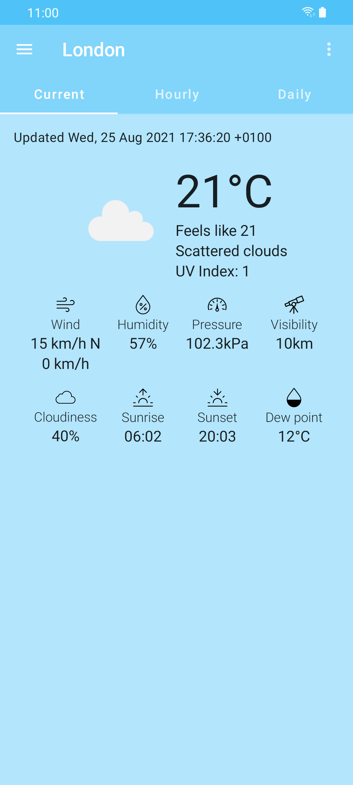
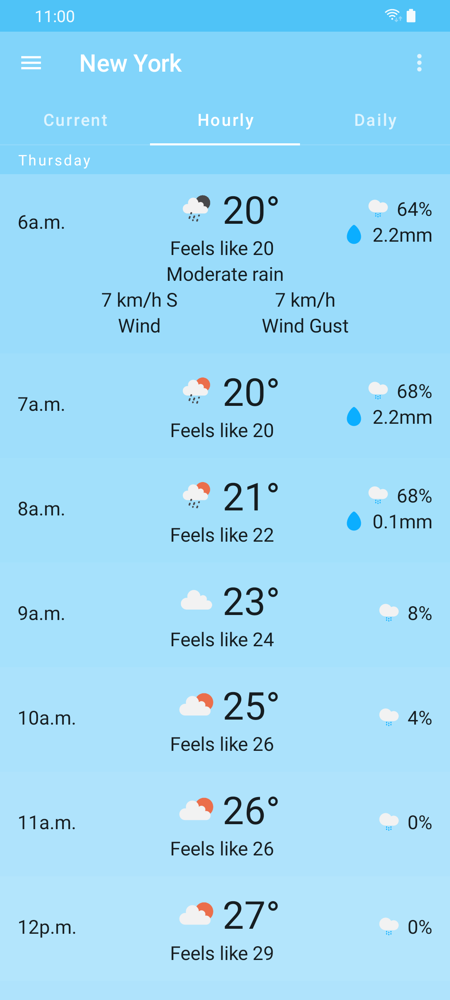
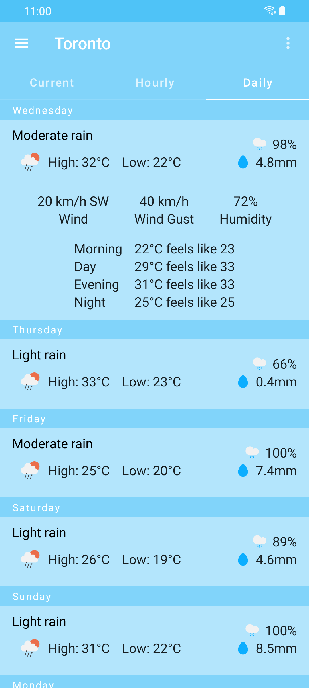
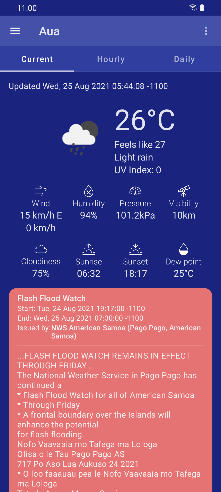

<p align="center"></p> 
<h2 align="center"><b>Atmostate</b></h2>
<h4 align="center">A weather app written with Jetpack Compose using OpenWeatherMap</h4>
<div align="center"><a href="https://androidweekly.net/issues/issue-482"></a></div>
<p align="center">
<a href="https://github.com/ramzan/atmostate/releases/" alt="GitHub release">Get the APK</a>
</p> 
<hr>

## Features
- offline caching
- fetching data for current user location
- follows Google's recommended MVVM architecure

## Screenshots
<div align="center">
  
  
  
  
</div>

## Building
Add the following line to local.properties:
```
OWM_API_KEY=XXX
```
where XXX is your OpenWeatherMap API key.

## License
[](http://www.gnu.org/licenses/gpl-3.0.en.html)  

Atmostate - Copyright (C) 2021  Ramzan Sheikh

This program is Free Software: You can use, study share and improve it at your
will. Specifically you can redistribute and/or modify it under the terms of the
[GNU General Public License](https://www.gnu.org/licenses/gpl.html) as
published by the Free Software Foundation, either version 3 of the License, or
(at your option) any later version.

The icons used in this app are either derived or taken from the following:  

Free for commercial use:
- [Barometer icon](https://www.iconfinder.com/icons/315815/barometer_icon) by [Yannick Lung](https://www.iconfinder.com/yanlu)
- [Astronomy, space, telescope icon](https://www.iconfinder.com/icons/6622938/astronomy_space_telescope_icon) by [www.wishforge.games ](https://www.iconfinder.com/bitfreak86)

Used under the [MIT License](https://mit-license.org/):
- [Sunset icon](https://www.iconfinder.com/icons/2561397/sunset_icon) by [Cole Bemis](https://www.iconfinder.com/colebemis)
- [Sunrise icon](https://www.iconfinder.com/icons/2561396/sunrise_icon) by [Cole Bemis](https://www.iconfinder.com/colebemis)
- [Percent icon](https://www.iconfinder.com/icons/2561368/percent_icon) by [Cole Bemis](https://www.iconfinder.com/colebemis)
- [Wind icon](https://www.iconfinder.com/icons/2561504/wind_icon) by [Cole Bemis](https://www.iconfinder.com/colebemis)
- [Cloud icon](https://www.iconfinder.com/icons/211721/cloud_icon) by Ionicons

Used under [CC BY 3.0](https://creativecommons.org/licenses/by/3.0/):
- [Drop, misc, water icon ](https://www.iconfinder.com/icons/1276839/drop_misc_water_icon) by [Craft Icons ](https://www.iconfinder.com/aathis)
- [Brightness, contras, light, sun, winter icon](https://www.iconfinder.com/icons/4831002/brightness_contras_light_sun_winter_icon) by [Sabr Studio](https://www.iconfinder.com/perpixel)
- [Drop, forecast, humidity, precipitation, rain, weather icon](https://www.iconfinder.com/icons/2682839/drop_forecast_humidity_precipitation_rain_weather_icon) by [Laura Reen](https://www.iconfinder.com/laurareen)
- [Forecast, snow, snowflake, weather icon](https://www.iconfinder.com/icons/2682823/forecast_snow_snowflake_weather_icon) by [Laura Reen](https://www.iconfinder.com/laurareen)
- [Cloud, cloudy, forecast, rain, sun, weather icon](https://www.iconfinder.com/icons/2682845/cloud_cloudy_forecast_rain_sun_weather_icon) by [Laura Reen](https://www.iconfinder.com/laurareen)
